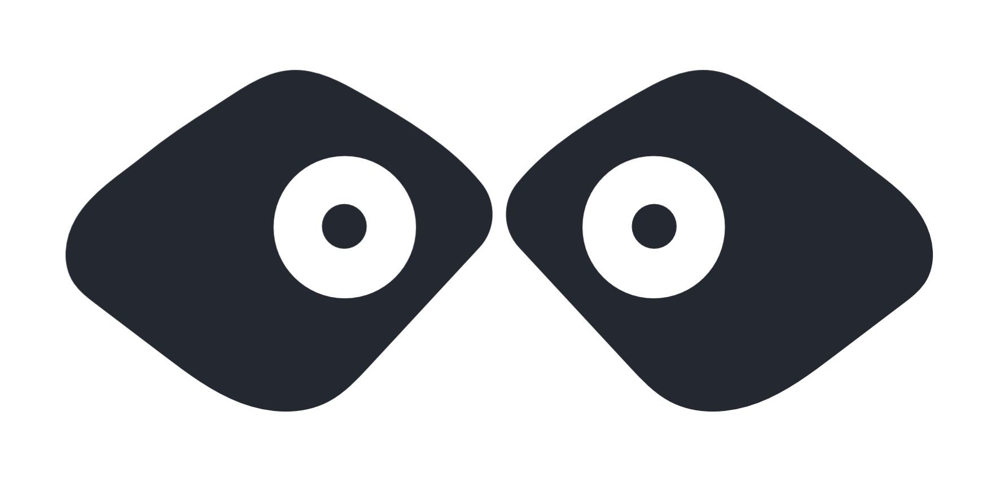

== C'est quoi, un bouchon ?

[%step]
* Un stub
* Un mock
* Un __dummy__
* ...

[NOTE.speaker]
--
En gros, tout ce qui peux se substituer à une valeur réelle.
--

[%notitle, transition=fade]
=== problème

[.description-front]
etoile-delamort-frontend.js

[.description-back]
EtoileDeLaMortBackend.java

++++
include::images/front-back-connection.svg[size=fill]
++++

[%notitle, transition=fade]
=== problème

++++
include::images/front-back-connection.svg[size=fill]
++++

[.dialog1.fade-in-then-out, step=1]
"Oui bonjour, j'aurais besoin de l'utilisateur fglkj45768, svp."

[.dialog2.fade-in-then-out, step=2]
"Papa tango charlie, bien reçu : 
{"nom":Vador","prénom":"Dark"}"

[.dialog3.fade-in-then-out, step=3]
"gloups"

[%notitle, transition=fade]
=== problème

++++
include::images/front-back-connection.svg[size=fill]
++++

[.cross]
image::images/cross.svg[]

[%notitle.with-mockoon, transition=fade]
=== problème

++++
include::images/front-back-connection.svg[size=fill]
++++

[.mock]
